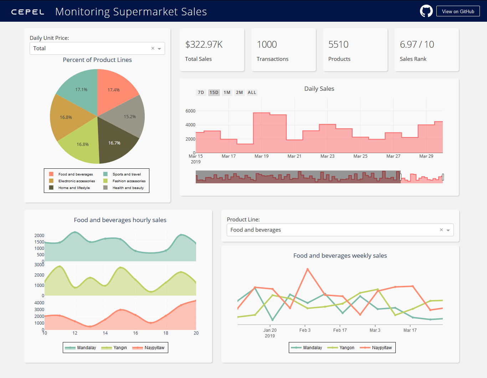

# Monitoring Supermarket Sales
Live: http://cepel-supermarket-sales.herokuapp.com/  
by Tolgahan Çepel
## Description
This dash application visualizes supermarket sales data to get insights from it. Even there are more details to show, because it is my first dash app, I have deployed a clean version.

Dataset: https://www.kaggle.com/aungpyaeap/supermarket-sales

## Installation and Usage
1. Install all dependencies listed in requirements.txt - all packages are pip-installable.
2. Run app.py to launch a local Dash server to host the Dash app. A link will appear in your console; click this to use the Dash app.

## Screenshot

